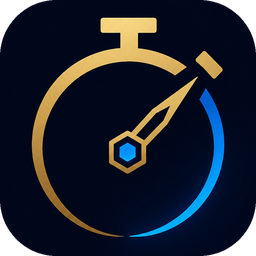

# Flashwatch

Overlay that tracks enemy summoner spell and ultimate cooldowns by reading the
in-game chat with OCR. No key presses needed during a game.

<br clear="left">

The logo files under `resources/brand/` are cut from the artwork at
`design/brand/flashwatch-logo.png` by `tools/make_brand.py`, and are what the
tray, the taskbar, both window headers, the executable and the site all wear.
Replace that one file and run the script again if the artwork changes; nothing
regenerates them at build time, and the painting itself stays out of
`resources/` so it is not carried into the executable.

## How it stays safe

The application only ever looks at pixels on your screen, the same information
you can see yourself. It does **not** inject into League, read its memory, touch
its files, or send any input. The only network traffic is to Riot's public Data
Dragon CDN, for champion names, spell names, cooldowns and icons.

## Why it is reliable

It keys on the game's own announcement, not on what players type. In a real game
that announcement is the cast line, and League prints it **for enemies only** — it
never narrates your own team:

```
(12:04) Darius a utilisé Saut éclair
│       │                └─ the spell
│       └─ the champion, an enemy by construction
└─ the game clock
```

An English client says `Darius used Flash` or `Darius has used Flash`; both are
matched, as is the French wording, whichever data locale is loaded.

The cooldown itself comes from the game's table (Flash: 300 s, or 246 s with
Cosmic Insight, which is assumed by default). The clock is what makes reading the
line *late* cost nothing: the app compares the line's timestamp against where it
already believes the game clock to be and back-dates the timer by the difference.

A second form is also accepted, and states the remaining time outright:

```
Ayoub (Lux): Attendez Ahri Saut éclair - 245 sec.
└─ author ──┘ └wait┘ └target┘└─ spell ─┘  └remaining┘
```

**This one is a test aid, not a real-game message.** Typing it in chat is the
quickest way to prove the OCR is reading your chat area at all: it carries a
number, so the resulting timer is unambiguous. When such a number is present it is
authoritative — nothing about rank or haste is guessed, so an ultimate timed this
way is exact too — and the timer is anchored on an absolute deadline
(`ready_at = timestamp + stated_seconds`) so repeats of the same line agree
instead of fighting.

> This correction needs a game clock. Either source works: the `(mm:ss)` timestamp
> prefixing chat lines, or — better, because the player can switch timestamps off —
> the match timer itself, once its area is placed in test mode (see *Four areas,
> same frame*). Without any clock the timer is anchored when the line is read
> instead, accurate to roughly a second in the steady state but losing whatever
> the detection delay was. **Settings → Status → "Estimated clock"** shows `-` when
> no clock is being read.

**Once set, a timer is left alone.** Everything that could move a running
countdown is refused rather than trusted, because a wrong number presented as fact
is worse than a missing one:

| A line saying… | …while a timer runs |
| --- | --- |
| the same or less time (the line re-read, or scrollback revealing an older one) | ignored |
| materially more time (15 s+) | treated as a recast, timer restarts |
| a cooldown recomputed from a base value over one whose seconds were *stated* | ignored — a stated number outranks any estimate |
| nothing left of the cooldown (read far too late) | ignored; it can no longer delete the entry |
| a **confirmed** cast over a timer that was only inferred | takes over — duration and start both recomputed |

That last row is the one exception, and it is not really one. A bare
`<Champion> <Sort>` line never says the spell was *cast*, so the timer built on it
guesses *when* as much as *what*: a line that does say so is better evidence on
both counts. It is marked with a **`?` chip on the bottom-right of the spell
icon** — on the icon rather than in front of the countdown, since `?4:23` reads as
part of the time and the time is what has to be legible at a glance. Pinging the
spell once you are sure clears the chip and corrects the number.

The same caution applies to clearing the board. A game ending is read from the game
*process*, not from the window answering: alt-tab, a loading screen or one unlucky
window enumeration used to look like "the game ended", wiping every timer and then
starting a "new" session on the next poll. And a chat line whose clock reads
suspiciously early — `10:45` misread as `0:45` — now needs a second line to agree
before it counts as a new game.

The two forms are trusted differently, and the difference is the author prefix.
`Attendez … - N sec.` is self-verifying — the trailing count is not something that
appears by accident — so it is accepted whether or not a name precedes it, which is
what lets you type it yourself as a test. The bare `a utilisé` / `used` wording has
nothing to check against and a teammate could plausibly type those words, so it is
only trusted **unattributed**, exactly as the game prints it. Ordinary chat, pings
and emotes fall through and are discarded.

## Timers your team calls in chat

Everything above exists to tell the game's wording apart from a human's. This is
the one form that is *only* ever human — and it is how half of League actually
communicates cooldowns:

```
(12:04) Ayoub (Lux): jgl flash 950
                     │   │     └─ back up at 9:50 on the game clock
                     │   └─ the spell
                     └─ the lane, or a champion's name
```

The number is a **point on the game clock**, not a duration, because that is what
players mean by it. So a call read six seconds late still ends on the right
second. `950`, `9:50` and `9 50` are the same call; one or two digits are whole
minutes (`bot heal 7` → 7:00).

Both halves are as loose as typing is. The lane may be `top`,
`jgl`/`jng`/`jg`/`jungle`, `mid`/`milieu`, `adc`/`bot`, `supp`/`sup`; the spell
may be its English name, its localised name or the usual shorthand (`tp`, `exh`,
`ign`, `ult`). Naming the champion instead of the lane works too, and either
order does: `flash jgl 950` reads the same as `jgl flash 950`.

**A time is required. No number, no timer.** `top no flash` is a statement about
the world, not a cooldown, and starting five minutes on it would be worse than
reading nothing at all. So is `mid ss 30`, and so is `gg wp 10`: all three parts
have to parse before anything happens, which is what keeps ordinary chat out.

Two more guards, both from the clock: a call pointing at a time already past
starts nothing, and one pointing further ahead than any cooldown in the game is
not a cooldown either.

A called timer carries the same **`?`** as an inferred one, because it is
somebody's word rather than the client's — and the client's own number replaces
it, and clears the mark, the moment one arrives. Switched off with
**Settings → Tracking → "Timers called in chat"**.

Naming a *lane* needs to know who plays there, which is the next section.

## Reading the enemy's lanes

Both the loading screen and the scoreboard list a team in the same order — top,
jungle, mid, bot, support — and neither labels it. So the framed area is cut into
five cells and **the cell a champion is found in is the role**. Two surfaces
because they are available at different moments:

| | When | How the champion is identified |
| --- | --- | --- |
| Loading screen | Once, for half a minute, before the game | its **name**, printed on the card |
| Scoreboard (Tab) | Any time during the game | its **portrait**, matched against the icons already cached for the overlay |

The scoreboard has no champion names in it — it prints summoner names — so
reading it is a picture comparison rather than an OCR pass. That comparison is
measured against all 173 icons put through an unkind imitation of a scoreboard row
(odd resize, blurred, dimmed as for a dead player, framed): every champion is
recognised and none is confused with another, provided the frame hugs the
portraits. Draw it much larger than they are and it stops recognising anything,
which is deliberate — a frame around *both* teams reading as one is the failure
that would put every lane one out.

Nothing is believed on one look, for the same reason the game clock is not: the
loading frame holds the game world once the game starts, and the scoreboard frame
holds it whenever Tab is not held. A reading has to place at least three of the
five **and** be produced twice identically before it reaches the timers. Reading
stops altogether once all five lanes are known, and starts again with the next
game.

A role you pick yourself in **Settings → Enemies** always wins over one read off
the screen, and the whole thing is switched off with **Settings → Tracking →
"Read the enemy roles from the screen"**, which leaves that list the only source of roles as
before.

## Setup

Requires Python 3.11 (see *Known constraints*).

```bash
py -3.11 -m venv .venv
.venv\Scripts\python -m pip install -r requirements.txt
```

Then launch:

```bash
run.bat
```

First run downloads champion/spell data and ~350 icons (about 9 MB) and caches
them under `assets/cache/`. Later runs are offline and instant.

**Launching it opens its window**, and it also lives in the system tray (the
notification area of the taskbar) — double-clicking the tray icon brings the
window back at any time. A program that appears to do nothing when you
double-click it is a program you double-click again, which is what the previous
tray-only start actually produced.

Two exceptions, and they are different questions:

- **a login is not a launch.** When Windows starts Flashwatch at boot it stays in
  the tray, whatever the setting says. Autostart exists so the program is
  *already running* when a game begins; a settings window every morning is the
  opposite of that. The Run entry carries a `--startup` flag, which is the only
  thing that tells a boot from a double-click — an entry written by an older
  build is rewritten the next time the program starts.
- **the first run belongs to the guide.** It is the introduction and hands over
  to the settings window itself; two windows at once on the very first launch is
  clutter at the worst moment.

Untick **Settings → Startup → Open the window on launch** to go straight
to the tray instead.

**To close it**, any of:

- right-click the tray icon → **Quitter (fermer le programme)**
- the settings window's **X**, or right-click its taskbar button → Close
- the **Quitter** button at the bottom of the settings window

Use **Masquer** instead if you want it to keep running in the tray. Starting it
twice is not a problem: the second copy says so and stands down, rather than
OCR'ing the same chat and drawing a second overlay — and the copy already running
raises its window, which is the same answer a double-click on the tray icon gives.

## Publishing a version

Pushing to `main` publishes a release, on its own:

1. the whole test suite runs on a Windows runner (`QT_QPA_PLATFORM=offscreen`,
   which every suite was verified to pass under);
2. the next version number is worked out from the newest `vX.Y.Z` tag;
3. `src/version.py` is stamped, so the built copy knows what it is;
4. `build.py` produces the executable and the release is published with it
   attached, notes included.

The version moves by a patch unless a commit message in the range says otherwise:
write `[minor]` or `[major]` anywhere in one. `[skip release]` in the head commit
skips the run entirely, and changes confined to `site/**`, `*.md` or `.github/**`
never trigger it — documentation is not a new binary.

The notes are the commit subjects since the previous tag, with the noise dropped
(merges, `wip`, `typo`, formatting), followed by a fixed installation section.
Edit them afterwards on the release page if you want to say more: **the site reads
the releases live**, so an edit shows up without redeploying anything.

Try the version arithmetic and the notes before pushing:

```bash
.venv\Scripts\python tools\release_meta.py            # prints, changes nothing
.venv\Scripts\python tools\release_meta.py --bump minor
```

The workflow needs no secret — `GITHUB_TOKEN` is provided to it — but the
repository must be **public** for the download page to list versions and for
anyone to download without an account.

## How a copy already out there updates itself

Publishing is the whole distribution step: a running copy finds the release on
its own, four seconds after start-up, through one request to
`/repos/.../releases/latest`. It reports and nothing more — the banner across the
top of the settings window offers the version, and the download only starts once
the button is pressed. `Verifier au demarrage` in the settings turns the check
off; *Ignorer cette version* silences one release and only that one.

The install replaces the executable **in place**, which is what keeps a folder
holding one program rather than one file per release:

```text
Flashwatch.exe      -> Flashwatch.previous.exe    (still running; Windows allows
Flashwatch.new.exe  -> Flashwatch.exe              a running image to be renamed,
                                                   just not overwritten)
next start-up          Flashwatch.previous.exe deleted
```

Three renames on one directory, so nothing is ever half-written, and the old
version is only moved aside once the new one is downloaded and checked — right
size, and it starts with `MZ`, because a captive portal's sign-in page arrives as
a perfectly successful HTTP 200. If the second rename fails the first is undone.
Settings and the icon cache live in `assets` beside the executable, so they are
untouched by any of it.

Two things this deliberately does not do: it never installs without being asked,
and it never runs while a game is on — the button is in a window, and that window
is not where anyone is looking mid-match.

### Keeping the configuration when the update is done by hand

Not everyone updates from inside the program: plenty of people take the .exe from
the releases page and run it from wherever the browser dropped it. That is a new
folder, so it is a new `assets` — and a copy that had been positioned, themed,
switched to English and pointed at the right chat area would come up as a fresh
install.

So every run leaves a note of where its data lives, in
`%LOCALAPPDATA%\Flashwatch\last-data-root.txt` — outside every folder an update
can change. A start-up that finds no settings of its own reads that note and
copies the previous ones in:

```text
Downloads\Flashwatch.exe        first start, no assets\settings.json
        ↓                        reads the note
C:\Tools\Flashwatch\assets\settings.json    copied in, the old copy left as it was
```

Only ever a gap being filled — an existing `settings.json` is never overwritten,
so this cannot reach across and clobber the copy being used. The icon cache is
not copied: 20 MB of files the first run downloads by itself, against a slow first
start, is not a trade worth making.

Settings written by a *newer* version survive too. Keys this build does not know
are not loaded — nothing unknown reaches the running program — but they are
written back out untouched, so going back to an older .exe does not quietly strip
the file of everything the newer one had added. A `Réinitialiser` is the one thing
that clears them, which is what being asked for a clean slate means.

`updater.py` holds all of it and imports no Qt, which is why `test_updater.py` can
drive the whole swap — including both failure paths — against a temporary
directory and a fake HTTP session.

## Sending it to someone

```bash
.venv\Scripts\python -m pip install pyinstaller
.venv\Scripts\python build.py            # -> dist\Flashwatch.exe   (~99 MB)
.venv\Scripts\python build.py --dir       # -> dist\Flashwatch\      (a folder)
.venv\Scripts\python build.py --out DIR   # -> DIR\Flashwatch.exe
.venv\Scripts\python build.py --console   # keeps a terminal, to see start-up errors
```

Windows will not overwrite a running program, so close Flashwatch before rebuilding
(the script says so rather than failing a minute in) — or use `--out` to build a
copy somewhere else.

`dist\Flashwatch.exe` is the whole program: **no Python, no install, nothing else to
send**. The recipient double-clicks it and it appears in the system tray. Zipping it
saves nothing (0.5%, it is already compressed) and is only worth doing for a channel
that refuses `.exe` attachments.

What they should expect:

- **Windows will warn.** An unsigned executable trips SmartScreen ("Windows
  protected your PC") — *More info* → *Run anyway*. Some antivirus products flag
  PyInstaller bundles on sight; that is the packer, not the program. Signing it
  would need a code-signing certificate.
- **First launch needs internet**, once, to fetch champion data and ~350 icons
  (9 MB). After that it runs offline.
- **It creates an `assets` folder next to itself** — settings, the icon cache and
  `flashwatch.log`. Put the .exe in its own folder rather than straight on the
  Desktop. If that location is read-only (Program Files, a network share), it
  falls back to `%LOCALAPPDATA%\Flashwatch` instead of failing to save.
- **A few seconds to start.** A one-file build unpacks itself into a temporary
  directory on every launch; measured at 2.7 s to the first log line here. The
  `--dir` build starts instantly but has to be zipped and extracted, and the .exe
  inside it will not run on its own.

Both builds were verified from a clean folder on a machine with no Python: data
downloaded, OCR engine loaded, chat area found in a live game.

### Why it is 99 MB, and why not less

A `build.py` run prints `left out N collected files`: PyInstaller's hooks collect
whole dependency trees, and most of what they gather here is never opened. The
generated spec filters the bundle itself — excluding a *module* does not remove the
C++ libraries behind it. Measured in a folder build, biggest first:

| Left out | Raw | Why it is not needed |
| --- | --- | --- |
| `opencv_videoio_ffmpeg*.dll` | 29 MB | nothing decodes video; capture is screenshots |
| `opengl32sw.dll` | 20 MB | Mesa software OpenGL, for Qt Quick — this is a raster QWidget app |
| `Qt6Quick`, `Qt6Qml`, `Qt6Pdf`, `Qt6Network`, `Qt6Svg`… | 21 MB | libraries behind the PySide6 modules already excluded |
| `PIL\_avif`, `_webp`, `_jpeg2k` | 10 MB | codecs for formats no icon here uses |
| Qt translations, `qml/`, unused plugins | ~7 MB | the app ships its own strings |

That is 316 MB → 237 MB unpacked, 134 MB → **99 MB** as one file.

The rest is genuinely used, and its floor is set by three libraries:

| Kept | Raw | Packed |
| --- | --- | --- |
| `cv2.pyd` (OpenCV) | 82 MB | 29 MB |
| onnxruntime | 33 MB | ~13 MB |
| OCR models | 15 MB | ~14 MB |
| numpy + OpenBLAS | 25 MB | ~10 MB |
| Qt6Core/Gui/Widgets + bindings | 35 MB | ~14 MB |

OpenCV is the obvious target and it cannot go: `rapidocr_onnxruntime` imports it
too, so removing it means replacing the OCR engine, not just this app's own image
handling. `opencv-python-headless` was measured and rejected — its `cv2.pyd` is
81.9 MB against 82.3, because the GUI parts of OpenCV were never the heavy bit.
UPX was left off deliberately: it barely helps a bundle that is already
zlib-compressed, and it makes antivirus false positives markedly more likely.

Going meaningfully below ~90 MB would mean a different OCR stack.

## Play in borderless, not exclusive fullscreen

Windows does not allow any overlay to draw over an exclusive-fullscreen game.
Set League to **Borderless** in video settings. Everything else works either way.

## Language

English out of the box, French on request, picked in **Settings → Language**
(the setup guide asks on the first screen). One choice drives three things: the
wordings looked for in chat, the champion and spell names downloaded from Data
Dragon, and the interface itself.

Set it to whatever **your League client** is in — that is the language the chat is
printed in. Switching applies straight away: the settings window and tray menu are
rebuilt, and the Riot data for the new locale is fetched in the background (any
running timers are cleared, since their champion names came from the old one).

| Form | French | English |
| --- | --- | --- |
| cast — what a game prints | `Ahri a utilisé Saut éclair` | `Ahri used Flash`, `Ahri has used Flash` |
| stated cooldown — typed, to test | `Attendez Ahri Saut éclair - 245 sec.` | `Wait Ahri Flash - 245 sec.`, `Wait for Ahri's Flash - 245 seconds` |

Nothing is hardcoded: names come from Data Dragon, and the English spell names are
indexed whichever locale is loaded, so an English client still reads correctly if
the app is left on French data. Another language can be added by extending
`SYSTEM_VERBS` and `WAIT_RE` in `message_parser.py` and the table in `i18n.py`.

## How the chat area is found

Chat position depends on resolution, HUD scale and window mode, so nothing is
hardcoded. The app keys on chat's *content* rather than its shape:

1. **Explore.** Read the generous lower-left band of the window.
2. **Confirm.** A row is a chat line if it opens with a `(mm:ss)` clock, carries
   an author prefix (`Nom (Champion): …`), or matches the cooldown wording. Those
   rows define the chat region, which is then saved.
3. **Narrow.** Once confirmed, only that small region is read.

Several signals are needed because chat timestamps are a client option, so the
tracker pings do not necessarily carry one — a clock alone is too narrow an
anchor. None of these forms can be produced by terrain, minions or health bars.

> An earlier version instead recognised chat by its *shape* — clustering
> left-aligned rows of glyph edges. It passed synthetic tests and failed
> completely on real footage, locking onto scenery in the middle of the screen
> and reporting a different answer every few seconds. The test backgrounds were
> too clean; they now carry heavy high-frequency clutter.

### Finding the rows: two masks, not one

Locating chat means first finding the *rows of text* in the band, and that is done
without the OCR detection network — a morphological pass costs 1 ms against its
265 ms. Two masks are computed and their rows unioned, because neither alone finds
every chat line:

| | synthetic suite (1080p→4K, 3 HUD scales, windowed) | real capture, chat box closed, 13 px glyphs |
|---|---|---|
| gradient + Otsu | 6/6 | **0 of 9 rows** |
| white-hat strokes | **1/6** | 9 of 9 rows |
| both | 6/6 | 9 of 9 rows |

The gradient is thresholded *globally*, and that is what it cannot recover from:
one sunlit patch of terrain raises the single threshold above the response of
faint chat elsewhere in the same band. Measured on the sample frame, Otsu settled
at 69 while the chat's own gradient sat below it, and **no** global level
separated them — lowering it welded the nine lines into blocks several lines tall.
A white-hat has no global threshold to get wrong: it keeps structure brighter than
its own surroundings and thinner than its kernel, which is what a glyph stroke is
whatever sits behind it. It is an addition and never a replacement — on the
synthetic frames it splits or drops rows the gradient reads cleanly.

The union is not the cost it looks like. It offers ~2 more rows per band, and its
rows are often *tighter*, which makes recognition — the expensive step by far —
cheaper rather than dearer: 338 ms against 476 ms at 1080p, 487 ms against 908 ms
at 1440p.

## If nothing is detected

**Press Test** (control window, home page — or the guide's last-but-one step). A
real game frame ships with the program, and the button runs the whole chain on it:
search band → OCR → rows that read as chat → chat region → parse → timers. So it
separates the two halves of the pipeline without a game running and without
anything to type. A pass means everything downstream of the capture works and you
are simply waiting for an enemy to use a summoner spell.

What it cannot prove is that *your* screen is being captured correctly, since no
screen is captured — the card says so. For that, frame the chat during a game (see
below). `tests/test_self_test.py` runs the same thing headlessly, and doubles as
the regression guard for the two-mask segmentation above.

Then open **Settings → Debug**. It shows every line the OCR read, plus "near
misses": lines that named a champion but did not parse. If the system wording in
your client differs from what the parser expects, it will appear there, and
`SYSTEM_VERBS` in `src/message_parser.py` can be adjusted to match.

If the chat area itself was not found, use **Settings → Statut → Définir la zone
manuellement** and drag a rectangle around the chat. A manual region is saved and
always takes priority over automatic detection.

### Mode test : placer la zone à la main, en voyant ce qu'elle lit

Drawing a rectangle blind tells you nothing about whether it works. **Settings →
Statut → Mode test : placer la zone OCR** (also in the tray menu) puts a frame on
screen around the area actually being captured, and keeps it there while you
adjust it:

* drag the **edges** to move or resize it, or nudge with the **arrow keys**
  (1 px, `Maj` = 10 px, `Ctrl` = resize);
* the capture worker follows the frame as it moves, so the readout under it
  updates within a fraction of a second: how many rows were read, how many were
  recognised as chat lines, and the last chat line in full;
* green ticks down the left margin mark where each recognised row sits, so a
  frame that is too short or aimed at the scoreboard is obvious;
* the border turns **green** as soon as chat lines are being read;
* **Valider** saves the rectangle as the manual region, **Annuler** / `Échap`
  restores whatever was in use before — nothing is persisted until you validate.

The middle of the frame is genuinely empty: the window is a ring, cut out with a
mask, so the frame can never paint into the screenshot it is aiming, and clicks
in the middle still reach the game. Test mode also reads with League closed, so
the zone can be set up on a replay or a screenshot.

Unlike the timer overlay, this frame *does* take focus — the arrow keys have to
reach it — so clicking it during a game hands focus to it for as long as it is
open. It is a setup mode: validate, close it, and the overlay goes back to never
touching focus.

### Four areas, same frame

The chat is found automatically. The other three cannot be: a match timer is five
glyphs with no signature to search for, the scoreboard only exists while `Tab` is
held, and the loading screen is gone before anything could confirm a guess about
it. So each has its own button (and tray entry), and each opens the same frame —
several can be open at once:

| Button | What it is for |
| --- | --- |
| **Frame the chat** | the chat, as above |
| **Frame the game clock** | the match timer at the top of the screen |
| **Frame the loading screen** | the row of five enemies while the game loads |
| **Frame the enemies (scoreboard)** | the column of five enemy portraits in the `Tab` panel |

**Each of the three starts somewhere sensible for your screen.** They ship with a
default rectangle — the timer at the top right beside the minimap, the two team
areas over the shapes they read — and a fresh install rescales all three to its own
resolution, because they are stored as pixels but sit at a fixed *place* in
League's HUD. Left at their 1080p values they pointed at nothing on a 1440p or 4K
screen, which meant the clock probe reading empty pixels every 0.9 s for the life
of the install. The chat region is deliberately not rescaled: it is guarded by the
window size it was found at, and a plausible-but-wrong chat seed is worse than
none — it is adopted as confirmed and read for 30 s before the timeout sends
detection back to exploring, where a discarded seed would have started exploring at
once. See `settings.ZONE_FRACTIONS`.

Each frame judges itself on what its area is *for*, not on row counts: the clock
frame shows the time it parsed (`horloge lue : 12:34`) or says it cannot read one —
five glyphs are one row whether they read `12:34` or `l2;3A`. The two team frames
show the lanes they recognised (`rôles reconnus : TOP=Darius JUN=Viego …`), which
is the only thing that tells you whether the rectangle is drawn tightly enough.
Each area is saved separately and reopens where you left it, and the clock frame
can be much smaller than a chat line so it does not have to swallow the minimap.

**The clock, once validated, is used.** It is the game time itself, so it replaces
the timestamps prefixing chat lines — which the player can switch off, and which
the OCR can misread. That is what makes reading a line late cost nothing: the app
knows how old it was. Two consecutive readings must agree before the clock moves,
since the reference only ever advances and one misread would stick.

**The two team areas go on being read after their frame is closed** — unlike the
clock's, which is a probe, they are what *Reading the enemy's lanes* above works
from. The loading area is only looked at during the first two and a half minutes
of a session, because reading a card-sized band through the OCR is the most
expensive thing this program does and after that the band holds the game world.
The scoreboard area is compared against icons rather than read, which is cheap
enough to keep doing all game; both stop the moment all five lanes are known.

For a deeper look, run the diagnostic during a game:

```bash
.venv\Scripts\python tools\diagnose.py
```

It saves real screenshots plus every line it can read from the lower-left of the
screen into `assets/diagnostics/<timestamp>/`, which answers the questions a log
cannot: whether a ping writes a chat line at all, its exact wording, and where
it appears.

## Enemies only — an option, off by default

The wording a real game produces (`Ahri a utilisé Saut éclair`) is printed for
enemies only, so it is taken at face value and never filtered.

The stated-cooldown form is the ambiguous one: `Attendez Ahri Saut éclair - 245
sec.` reads identically whether Ahri is the enemy mid or somebody's own cooldown.
Its text says nothing about teams, but the screen does — the game draws **enemy
champion names in red** — so **Settings → Tracking → Enemies only** can make
that form's pixels decide.

It ships **off**, and the reason is the same fact: that form is in practice a line
you type yourself to test the OCR, and your own typing is not drawn red — left on,
the option would reject exactly the line used for testing. Turn it on only if you
see timers appear for spells that were not an enemy's.

The test looks at the row that was read, isolates its text strokes, and asks
whether one word is markedly redder than the rest of that line's text. It has
three outcomes rather than two:

| Verdict | Action |
| --- | --- |
| a red, word-shaped name | timer starts |
| no red name | ignored, and listed in **Debug** so it stays visible |
| the row's text is red across the board (chat with no panel over the red base, a particle burst) | nothing concluded; the line is read again on a later frame, once the game has moved behind it |

The third case matters: chat lines stay on screen for seconds, so declaring such a
row "ally" would silently lose real pings, while calling it "enemy" would trust a
red background. Waiting costs nothing.

## Accuracy

In a game, the cooldown comes from the game's table rather than from a stated
number, so the assumptions matter. **Cosmic Insight** (18% summoner haste) is
assumed by default — Flash is 246 s rather than 300 s — and Ionian Boots can be
assumed too, both in **Settings**. The rune is near-universal, which is why it is
the default; a wrong assumption there is the difference between 246 s and 300 s.

| Source | Accuracy |
| --- | --- |
| `a utilisé` / `used`, summoner spell | Base cooldown from the table, adjusted by the haste assumptions above. Exact when they match reality. |
| `a utilisé` / `used`, ultimate | Approximate, shown with a `~` prefix. |
| `Attendez … - N sec.` (typed, to test) | **Exact**, summoner spells *and* ultimates: the number is stated, nothing is guessed. |

Ultimate cooldowns depend on ability rank and haste, neither visible on screen, so
rank is inferred from the game clock and per-champion haste can be set in
`assets/settings.json`. The planned scoreboard reader will fill that in from enemy
items.

## The setup guide

Four things decide whether Flashwatch works at all, and not one of them can be
worked out by poking at the interface: League has to be in **borderless**, the
**client's language** decides the wording looked for in chat, the **chat area** is
found automatically (worth saying, since the settings are full of buttons that
suggest otherwise), and the **overlay** has three shapes and goes anywhere on
screen. So the first run walks through it: **eight screens** — the client's
language, welcome, borderless, pick a display, tune it, place it, the proof, all
set — a drawing each, about three minutes. It shows itself once, whether it is finished or
closed, and stays one click away afterwards under **Home → Setup guide** or in
the tray menu.

The tuning step is the appearance card out of the settings window, put where
the preview already is: theme, opacity, overall scale, the countdown's face and
size down the left, and what the display shows — idle, order, spells that are
back up, how long READY stays, the track on its end — to the right of the
Practice Tool panel, which redraws with every one of them. Same settings, same
words, same file: the settings window re-reads them when the guide writes, so
neither can undo the other. **Put it all back** returns exactly those eleven to
their defaults, and asks once before it does — it leaves the display picked on
the step before, and everything outside the step, alone.

The proof step is one button, and it needs neither League nor the Practice Tool:
it reads the game frame that ships with the program and starts the timers it finds
in it. It used to hand over a line to paste into the Practice Tool chat instead,
which asked the reader to have League open at that exact moment and to trust that a
line they had typed themselves proved something about reading the game's own
wording. The line is still parsed — see the accuracy table above — it is simply no
longer what the guide asks for.

It is a **direct port of `design/maquette/Onboarding *.dc.html`**, not an
interpretation of them. Those files are absolutely-positioned CSS on a fixed
1536 × 1024 canvas, so the window is a fixed 1536 × 1024 canvas too: one painted
widget, one uniform scale applied at the top of `paintEvent`, and every number in
it — 46, 158, 382, 896 — is the number in the mockup. Nothing is laid out by Qt, so
nothing drifts from the design when a translation runs long or the window is
resized, and the screens *are* the mockups rather than resembling them. The face is
the mockups' own, **Mulish**, embedded from `resources/fonts` (SIL OFL, 212 KB),
with sizes in pixels like the CSS.

It is also the one dark surface in a light product, deliberately: it is read once,
before anything else exists, and every figure in it depicts League, which is dark.

There are **no child widgets** in it, and that is what lets step one — the client's
language — change the language of steps two to eight without the window being
torn down: every word is fetched from `tr()` at paint time, so switching language is a
repaint. It used to be a rebuild, which closed and reopened the window under the
reader's cursor and raised a tray notification behind it.

Everything moves, and not for decoration. A guide is read in one order, so the
stepper's line fills *forwards*, a page slides in from the side it came from, and a
figure assembles in the order it should be read. Qt has no CSS transitions, so each
of those is a number animated by hand and read inside a `paintEvent`. The cost is
watched: an entrance lasts a few hundred milliseconds and stops, and the one
looping animation runs at twelve frames a second, only on the visible step, and
gives up after seven seconds — nothing here spins while League is being played.

The drawings are painted, not shipped: no PNGs in a bundle that is already 99 MB,
they follow the palette, and they redraw at any DPI. That includes the two figures
that redraw League's own client — its menu path and its video options — which are
schematics carrying the client's exact labels rather than screenshots: a capture
would age with every patch and exist in one language only. The three overlay
sketches are the same code the settings page draws, so a display chosen in the
guide is recognised in the settings.

## Light, and why

The whole product is light: a cool near-white window, a deep blue accent, and an
overlay that is a near-opaque **light** panel carrying dark numerals. That last part
is the one that needed measuring rather than taste.

A translucent panel over a game composites with whatever is behind it. A *dark* panel
at 42% over a bright victory screen lands on mid grey, and the white countdown on it
scores **3.56:1** — unreadable at a glance, exactly when a fight makes the screen
busiest. A *light* panel has the opposite problem at the same opacity, so it is drawn
at **80%** instead: it then composites to roughly the same light grey whatever is
behind it, and the dark countdown clears **10:1 on every background**. The painted
shadow flips with it — dark text wants a light halo, not a black one.

The trade is honest: the light overlay hides a little more of the game than the dark
one did. In exchange it is the only one of the three themes that never becomes
illegible. **Dark** and **Neon** are still there in *Settings → Display* for
anyone who prefers them, and the whole light palette is checked at 4.5:1 or better
against both of its grounds — the ratios are in the comments in `src/theme.py`, so a
future edit can be verified instead of eyeballed.

## Overlay

Three displays, switchable in **Settings → Display**. They show the same
information; none of them is right for everyone, so the choice is the user's — and
each one **goes anywhere on screen** and keeps **its own position and size**, so
trying another cannot lose where the first was placed.

**Barre chrono** (default) — a discreet strip at the top centre of the screen.
Each spell on cooldown is a champion portrait with its spell badged on the corner,
riding the track **left to right** as the cooldown runs down: it enters at the
left the moment a spell is used and arrives at the right as it comes back up. So
"who is nearly back" is readable without reading any numbers. A stem drops from
the rail to each portrait, and the far end of the rail is tinted green — that end
means "back up".

**Cartes fixes** — one card per cooldown at a place that never moves: portrait,
**progress ring** closing around it, spell badge, countdown underneath. The ring
turns the way every cooldown sweep in the game itself turns, so it is read rather
than learned, and nothing sliding means nothing to find before it can be read.
Cards wrap onto more rows if the window is made taller, and are dropped rather
than stacked if there is no room — half a card is not information.

**Compact rows** — one row per spell: champion, spell, time left, and a
**gauge** that fills as the cooldown runs down. The most legible of the three and
the tallest, which is the trade.

The bar stays **off screen until you are in a game**: nothing is drawn on the
desktop, in the client or in champion select. It appears when League's in-game
window does, and goes away when the game ends. Untick **Masquer la barre tant
qu'on n'est pas en partie** to have it up all the time; it is also always shown
while unlocked, so it can still be positioned with League closed.

When a spell comes back up its marker reads **READY** at the right-hand end of the
track for a few seconds, then its entry disappears — long enough to be read as
confirmation, short enough that the bar keeps showing only what is actually down.
The delay is **Keep READY on screen** in the settings (5 s by default; 0 removes
the entry the moment it is ready, and the audio cue still fires).

With nothing on cooldown the bar fades to just its track — faint, but enough to
show the app is alive and where it sits. Untick **Afficher la barre vide** to make
it fully invisible at rest instead.

### The countdown's face and size

Two settings of their own, next to the overall scale, because they answer a
different question: the scale is how big the whole thing is, this is how much of
that the *number* takes. Wanting large portraits with a discreet readout — or the
opposite — cannot be said with one control.

**Taille du chrono** defaults to **half**. Everything else is unchanged; only the
countdown shrinks. It is safe to shrink because every layout in `overlay.py`
measures its rows *through* the same font, so a smaller number produces a smaller
block rather than a hole where it used to be.

**Police du chrono** offers whichever of a short list this machine actually has —
Bahnschrift, Segoe UI, Consolas, Tahoma, Calibri and a few more — plus
**Automatique**, which is the previous behaviour: the first of the built-in
preferences that is installed. Two rules decide what is on the list and nothing
else does. The digits must be **tabular**, all the same width, or the countdown
twitches on every tick as 1s and 4s trade places; and the face has to hold up
small, bold and coloured over an unpredictable background. Each entry carries a
multiplier that brings it to the same optical size as the others, so the size
setting means one thing whichever face is picked. Only the countdown is affected —
champion and spell names stay on the interface's own face, because they are text
and the countdown is a readout.

## The notification sound

Two cues: one a few seconds before a spell is back, one when it is. Both are
**synthesised** rather than shipped, so there is no audio dependency and no asset
to package. **Twenty-two voices** to pick from in **Settings → Notifications →
Sound**.

**Six ways of making a sound, not one voice at twenty pitches.** The first
version of this table was a single additive engine with the ratios and the note
changed between presets — which is not a choice of sound, it is the same
instrument played higher or slower, and it read as exactly that. What actually
separates one cue from another is the mechanism:

| Engine | What it does | Voices |
| --- | --- | --- |
| `struck` | decaying partials — a bar, a string, a bell | carillon, cloche, bol chantant, marimba, harpe, boîte à musique, toc-toc, tic |
| `fm` | one sine bending another; reaches metallic and reedy timbres no stack of partials gets to | cloche métallique, verre, anche, claves |
| `noise` | filtered noise, no pitch at all | souffle, balai, maracas, chuchotement |
| `glide` | a tone that slides while it sounds | montée, goutte |
| `modulated` | a tone wavering in level or in pitch | trémolo, vibrato |
| `swell` | faded in and out rather than struck | nappe, chœur |

On top of that, the **gesture**: one note, two, three, a chord, a repeated tap. A
double knock and a rising arpeggio differ more to the ear than any two timbres
do, so the patterns carry as much of the variety as the engines.

`tests/test_sound_and_type.py` measures that the variety is real rather than
claimed: the voices must span a factor of six in brightness, and the noise ones
must be measurably aperiodic where the tonal ones are periodic. Distinct bytes is
a bar the first table cleared easily while sounding like one instrument.

What every one still shares is what makes a cue bearable on the hundredth firing
in an evening: a raised-cosine onset and a faded tail, so no click at either end;
a low-pass over the top; and **one peak level across the table**, so choosing a
voice is never also choosing a volume. Nothing in the list is a voice line, a meme
or a klaxon.

Picking one plays it, and the **Écouter** button beside the list replays it — a
list of twenty-two names is useless without that, since nobody knows what "anche"
sounds like from the word. The audition works even with notifications switched
off, because refusing to answer "what does this one sound like?" would be a
puzzle rather than a safeguard.

Each voice says both things with the same instrument: a shorter gesture for
"nearly back", a fuller and generally rising one for "back up". Rising is the
point — a cooldown returning is good news, and everyone reads a rise that way
without being told.

Only the chosen pair is kept on disk. Twenty-two voices would be megabytes of WAV
cached for a choice made once, and rendering the pair back takes about a tenth of
a second.

## Trying it, and placing it, with League closed

**Settings → Display → Show sample cooldowns** (also in the tray) puts
six fake cooldowns on the overlay and leaves them there. They cover every state at
once — one just cast, one halfway, one inside the 30-second warning, one already
**READY**, plus the `?` of a spell that was only inferred and the `~` of an
ultimate whose rank is a guess — across all five roles, so what is being judged is
the real thing at its busiest rather than three bars flashing past.

It **stays on until it is turned off**, which is the point: comparing the three
displays, trying a theme, dragging the overlay to a corner and looking at it again
does not fit in twenty seconds. Entries that run out come back with a full
cooldown, so the colours keep crossing their thresholds while you watch.

**It ends by itself the moment a real game appears**, clearing the fake cooldowns
and putting click-through back. That is also what makes placing safe: press
**Move / resize** (or **Place it now** in the guide), take as
long as you like, and nothing has to race you back to a locked state — the state
that actually matters is "not unlocked while playing", and starting a game is
exactly when that is enforced. Nothing here can reach the timer logic: these
entries never come from a parsed line, and the control window says **ESSAI** in its
header for as long as the trial runs.

On the chrono track, two spells used in the same second land on the same point, so
the markers are placed as a group: each is nudged sideways just enough to clear
its neighbour, and the run is pushed back inside the bar's edges rather than piling
up against them. If more cooldowns are running than the bar has room for, they are
spread evenly over its full width — crowded, but never one portrait hidden behind
another. The time text remains the precise readout.

**Placing it.** Press **Move / resize** in **Settings → Display**
(or untick *Verrouillé*): the display is outlined, drag it anywhere, pull the
bottom-right corner to resize, then press the same button to lock it again. Locked
means click-through — the overlay can never be clicked or take focus from the game.
**Remettre en place** puts the current display back at its default spot, which is
what you want after changing resolution.

## The control window

Four places down the side rather than four tabs of switches across the top:

| | |
| --- | --- |
| **Home** | is it working — one sentence, the live readouts, the setup guide, and the one line to paste into chat to prove the whole pipeline. Enemies and their roles appear here as they are detected. |
| **Display** | which of the three displays, where it sits, theme, opacity, scale. |
| **Settings** | language, what is tracked, sounds, startup, updates. |
| **Troubleshooting** | the chat area, the zone frames, and every line the OCR read. |

Nothing was removed in the rebuild; what changed is rank. The expert switches
(click-through, cosmic insight, capture interval, enemy colour…) are folded into
**Advanced options** sections that say what they are before they are opened, and
every long explanation moved out of a control's own label into a dim line beneath
it — which also fixed a real bug: a `QCheckBox` will not wrap its text, so a switch
labelled with a full sentence set a floor of roughly 950 px under the window's
width, and the `resize()` asking for less was simply ignored.

The look is a port of `design/maquette/Flashwatch *.dc.html`, one file per place,
and a literal one: every length, type size and gap in `ui.py` is the number in
those files, and the palette is `theme.MENU`, filled the same way.

**One canvas, one scale.** The maquettes are a fixed 1448 × 1086 page, so the
window is a fixed 1448 × 1086 page too, fitted to the screen through a single
multiplier — the same thing `onboarding.py` does for the guide. Nothing is
elastic: at 100% it is the maquette pixel for pixel, and at 91% it is the same
drawing at 91%. That is why every number goes through `ControlWindow.s()`, why
the stylesheet is *generated* at a scale rather than written at one, and why the
maximise button grows the canvas instead of stretching a frame around it.

The four files disagree about the frame — three canvas sizes, title bars of 47,
48, 50 and 52 px — so the frame is `Flashwatch App.dc.html`'s, the largest and
most complete, and each page keeps its own numbers inside it. One number could
not be kept: the rail's buttons are `padding: 0 20px` inside a 205 px button, and
"Quitter le programme" at 16 px with a 22 px icon does not fit that. The HTML
overflows its own rail; a button cannot, so it is 12 px and 15 px type there.

Four things the maquettes draw that Qt has no way to style are done in Python
instead — the **switches** are painted, because QSS can colour a checkbox but
cannot slide a knob across it; the **chevrons and steppers** on fields are
painted by the widgets that own them, because Qt's own arrows are style-drawn and
an `image:` would need a file this program does not ship; the **icons** come out
of `icons.py` as geometry, for the same reason; and the **window chrome** is ours,
because the maquettes draw their own title bar.

Two pictures are the exception to "nothing ships as an image": the illustrations
behind the home page's headline and its enemies card, downscaled into
`resources/art` at 640 px — 75 KB the pair, against a 99 MB executable. They are
faded out towards the text by erasing their own alpha rather than by laying a
wash over them, which is the difference between a picture that dissolves into the
card and one with a visible seam down it.

## Layout

```
src/
  main.py            entry point, threading and wiring
  overlay.py         transparent click-through overlay, three displays
  ui.py              control window, settings, debug view, region picker
  icons.py           the window's line-art icons, drawn rather than shipped
  onboarding.py      the first-run setup guide: one painted 1536x1024 canvas
  zone_overlay.py    test-mode frame: place the OCR zone by hand, live
  ocr.py             capture loop, OCR, work-avoidance layers
  self_test.py       the Test button: the whole chain, on a real shipped frame
  chat_detector.py   locates the chat without hardcoded coordinates
  message_parser.py  OCR text -> confirmed spell events, and chat timer calls
  role_reader.py     the enemy's lanes, from the loading screen and the scoreboard
  roles.py           the five lanes: their order, and the words players use for them
  timer_manager.py   active cooldowns, dedupe, age correction
  game_detector.py   League process/window detection
  riot_assets.py     Data Dragon data and icon cache
  cooldowns.py       cooldown table
  i18n.py            every user-facing string, French and English
  settings.py        persisted configuration
  single_instance.py one copy at a time; a second launch opens the first's window
  audio.py           notification tones: 22 voices, synthesised on demand
build.py             packages everything into one .exe to send
site/
  index.html         download page: install guide, docs, live overlay mock —
                     same palette and same face as the window, one file, no build
tools/
  diagnose.py        in-game capture + OCR dump for troubleshooting
tests/               runnable checks, see below
resources/fonts/     Mulish, the interface's face (SIL OFL), shipped in the .exe
resources/art/       the home page's two illustrations, 75 KB the pair
resources/test/      the frame the Test button reads, and what is in it (2.3 MB)
assets/cache/        downloaded icons and data (created on first run)
```

## Tests

Each file is a standalone script that exits non-zero on failure:

```bash
.venv\Scripts\python tests\test_message_parser.py     # parsing and rejection
.venv\Scripts\python tests\test_wait_messages.py      # the real ping format
.venv\Scripts\python tests\test_faded_chat.py         # chat box CLOSED, faded text
.venv\Scripts\python tests\test_all_champions.py      # all 173 champions x 9 spells
.venv\Scripts\python tests\test_timer_manager.py      # dedupe, stale history, ults
.venv\Scripts\python tests\test_capture_pipeline.py   # detection at 1080p..4K
.venv\Scripts\python tests\test_ocr_performance.py    # work-avoidance layers
.venv\Scripts\python tests\test_app_shell.py          # tray menu, quit routes, overlay, test mode
.venv\Scripts\python tests\test_zone_frame.py         # the test-mode frame and its empty middle
.venv\Scripts\python tests\test_enemy_colour.py       # red name = enemy, over every backdrop
.venv\Scripts\python tests\test_bar_layout.py         # markers never overlap on the bar
.venv\Scripts\python tests\test_display_choice.py     # three displays, one position each
.venv\Scripts\python tests\test_onboarding.py         # the guide runs once, and changes what it says it does
.venv\Scripts\python tests\test_english_client.py     # the same messages, EN client
.venv\Scripts\python tests\test_language.py           # the catalogue and the switch
.venv\Scripts\python tests\test_timer_stability.py    # nothing may move a set timer
.venv\Scripts\python tests\test_extra_zones.py        # clock and scoreboard areas
.venv\Scripts\python tests\test_updater.py            # version maths, download guards, the swap
.venv\Scripts\python tests\test_settings_carry.py     # the config survives an update
.venv\Scripts\python tests\test_self_test.py          # the Test button, and both row masks
.venv\Scripts\python tests\test_zone_seeds.py         # the seeded areas follow the screen
```

`test_capture_pipeline.py` and `test_ocr_performance.py` render synthetic
game-like frames, so they exercise the real detection and OCR code without
needing League running. `test_self_test.py` complements them with a **real**
captured frame, which is the harder case and the one that decides whether both row
masks are needed: neither mask alone passes both files, so it deliberately asserts
that the gradient finds nothing in it and says where to look before removing
anything.

## Performance

Measured at 1080p on the development machine:

| | Cost |
| --- | --- |
| Idle frame (chat unchanged) | 0.10 ms — about 0.05% of one core at 5 Hz |
| Re-reading a region whose pixels are identical | 1.1 ms |
| Full read of the confirmed region | ~173 ms |
| Region showing only scenery (chat box closed) | ~162 ms |
| Explore pass (locating chat) | 0.6–1.3 s, throttled to once per 0.7 s |
| Clock zone, when configured | 20 ms every 0.9 s — about 2% of one core |

**Worst-case latency to read a new message: ~1.4 s** (the 1.2 s forced re-read
plus one full read). Worst-case CPU is one 162 ms read every 1.2 s — 13.5% of a
single core, roughly 1.7% of an 8-core machine — and only while the chat area
shows moving scenery. With chat static it drops to the 1.1 ms path.

Work is avoided in three places: a frame gate comparing glyph masks (so the game
world moving behind chat is not mistaken for new text), custom OpenCV row
segmentation instead of the OCR detection network (480 ms → 168 ms; two masks, see
*Finding the rows* above — it made the explore pass faster, not slower), and a
per-row recognition cache.

A **region confirmed in an earlier session is reused** on the next launch, which
skips the slow explore phase entirely. It is discarded if the window size changed.

> The row cache is keyed on an **exact** pixel hash. It was originally a tolerant
> image fingerprint, which measurement showed cannot work: two pings differing
> only in their seconds value ("245" vs "240") are indistinguishable at any
> downscale, while the *same* line over a darker background differs more than they
> do. A false hit served another line's cached text, so new pings were never read
> — the cause of "I pinged twice and it didn't register". An exact key can only
> miss, costing time rather than correctness.

## Known constraints

- **Python 3.11, not 3.13.** `rapidocr-onnxruntime` has no wheels for Python
  3.14, which is what is installed here alongside 3.11. 3.13 also works if you
  have it.
- **Chat detection is still unverified against a real game.** The timestamp-driven
  approach is validated on synthetic frames at 1080p/1440p/4K across HUD scales,
  with heavy background clutter, but only real footage proves it. While
  unconfirmed the app reads the whole lower-left band, so a detection miss
  degrades to "slower" rather than "reads the wrong pixels".
- **The exact system wording is assumed.** Data Dragon supplies champion and
  spell names but not client UI strings, so the verb phrase (`a utilisé`) comes
  from the observed message format. Confirm it in the Debug tab on first use.
